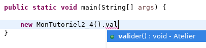
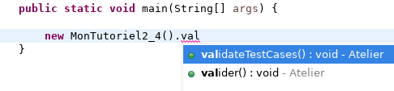

# Théorie 2.4: visibilités et attributs

<video width="50%" src="01.mp4" type="video/mp4" controls>

* Une méthode peut être visible (`public`) ou cachée (`private`),
  selon le contexte

* Si la méthode est cachée pour moi, je ne peux pas l'appeler

* Une méthode cachée n'apparaîtra pas dans les auto-complétions d'Eclipse

## Pourquoi différentes visibilités?

<video width="50%" src="02.mp4" type="video/mp4" controls>

* Prenons l'exemple de l'outil de validation.

* Le prof écrit du $[link ../../01/theorie/](code de librairie) et l'étudiant du code d'application

* Le prof ne veut *pas* que l'étudiant voit tout le code de la librairie
    * par exemple, le prof veut:

        

            
        

    * et non:

        

            
        

    * la méthode `validateTestCases` ne doit *pas* être appelée par l'étudiant
    * alors vaut mieux la cacher en la déclarant `private`

## API: *Application Programming Interface*

<video width="50%" src="03.mp4" type="video/mp4" controls>

* La visibilité est fortement liée à la notion d'API

* L'API document les méthodes d'une librairie que l'application peut appeler

* P.ex. <a href="https://docs.oracle.com/javase/8/docs/api/" target="_blank">l'API Java</a> documente les méthodes utiles à un programmeur Java

* Il n'a pas de méthodes `private` dans cette documentation. 
    * le programmeur n'en a pas besoin
    * les détails d'implantation sont inutiles 99% du temps

## Les règles clés 

<video width="50%" src="04.mp4" type="video/mp4" controls>

* Voici les règles de base pour la visibilité

<table>
<tr>
    <th></th>
    <th>Visible de l'extérieur de la classe</th>
    <th>Visible des sous-classes</th>
    <th>Héritable/redéfinissable</th>
</tr>
<tr>
    <th><code>private</code></th>
    <td style="text-align:center;">NON</td>
    <td style="text-align:center;">NON</td>
    <td style="text-align:center;">NON</td>
</tr>
<tr>
    <th><code>protected</code></th>
    <td style="text-align:center;">NON</td>
    <td style="text-align:center;">OUI</td>
    <td style="text-align:center;">OUI</td>
</tr>
<tr>
    <th><code>public</code></th>
    <td style="text-align:center;">OUI</td>
    <td style="text-align:center;">OUI</td>
    <td style="text-align:center;">OUI</td>
</tr>
</table>

* Il y a <a href="https://docs.oracle.com/javase/tutorial/java/javaOO/accesscontrol.html" target="_blank">d'autres règles</a>, mais les règles ci-haut couvrent 90% des cas.

## Quelle visibilité choisir?

<video width="50%" src="05.mp4" type="video/mp4" controls>

* Il faut se poser les questions:
    * *Est-ce que le reste du programme a besoin d'appeler cette méthode?*
        * si oui, alors choisir `public`
    * *Est-ce qu'une sous-classe aura besoin de redéfinir cette méthode*?
        * si oui, alors choisir `protected`
    * Sinon, choisir `private`

## Les attributs et la visibilité

<video width="50%" src="06.mp4" type="video/mp4" controls>

* Il y a deux types d'attributs:

    * *attribut défini*: l'attribut est défini dans la classe
    * *attribut hérité*: l'attribut est défini dans la classe parent (`public` ou `protected`)

* Il n'y a pas d'attribut redéfini.
    * pour accéder à l'attribut d'une sous-classe, il faut utiliser une méthode

## Les attributs représentent l'état privé d'un objet

<video width="50%" src="07.mp4" type="video/mp4" controls>

* En général, tous les attributs d'un objet sont cachés (`private`)

* Les attributs représentent l'état de l'objet, p.ex:
    * le kilométrage parcouru par le véhicule
    * le nombre d'oiseaux attrapés par le chat

* L'état est ce qui peut changer *en cours d'exécution*
    * (alors que le code des méthodes reste toujours le même)

* L'état est privé parce que l'objet doit toujours être appeler de la même façon
    * l'état est un détail d'implantation qui ne concerne pas le reste du programme

## Exemple: `accepterChargement` et `consomationLitresParKilometres`

<video width="50%" src="08.mp4" type="video/mp4" controls>

* Considérer la classe `Vehicule`:

    $[java ./Vehicule]()

* Le calcul de consomation d'essence est simple

* Dans la classe `Camion`, on ajout une notion de chargement:

    $[java ./Camion]()

* La notion de chargement est cachée grace à la visibilité `private`

* On ne **veut vraiment pas** que le `Vehicule` gère la notion de chargement:

    $[java ./Vehicule_mauvais]()

* Le code serait beaucoup plus compliqué et difficile à lire

* En plus, on veut que `Camion` puisse changer son code privé

    $[java ./Camion_tonnes]()

    * `Camion` représente maintenant le poids du chargement en tonnes
    * toutes les modifications sont privées à la classe `Camion`
    * il n'y a rien à changer ailleurs dans le code

## Exemple: `formater`

<video width="50%" src="09.mp4" type="video/mp4" controls>

* Considérer la méthode pour `formater`

    $[java ./Vehicule_formater]()

* La méthode est simple parce qu'on délègue le plus possible 

* Si on ne délègue pas, ça donne plutôt:

    $[java ./Vehicule_formater_mauvais]()

* Imaginer qu'on ajoute la sous-classe `Fourgonnette`

* Pour la première version, il n'y a rien à modifier!

* Pour la deuxième version, il faut ajouter du code:

    $[java ./Vehicule_formater_mauvais_fourgonnette]()

## Pour écrire du code lisible: apprendre à **déléguer**

<video width="50%" src="10.mp4" type="video/mp4" controls>

* j'imagine que ma classe est une librairie pour le reste du programme
    * qu'est-ce que ma classe devrait cacher? Rendre public?

* j'essaie de déléguer un comportement dès que possible:
    * à une autre méthode
    * à une autre classe
    * à une sous-classe

* en particulier, je me méfie des cas où:
    * ma méthode a plus de 20 lignes
        * je peux sûrement déléguer une partie à une autre méthode
    * j'utilise beaucoup de `instanceof` et de transtypage (*casting*)
        * je peux sûrement déléguer aux sous-classe
    * j'utilise beaucoup d'accesseurs (*getter*)
        * je peux sûrement déléguer à l'objet que j'appelle

* NOTES: 
    * les règles ci-haut couvrent 90% des cas
    * comme d'habitude, il y a des exceptions
        * il y a des cas où une méthode de 20+ lignes est plus lisible
        * il y a des cas où utiliser un accesseur est plus lisible
        * il y a des cas où utiliser `instanceof` est plus lisible

