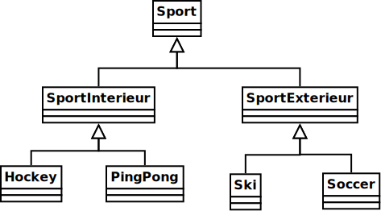

# Examen2

<strong>IMPORTANT</strong>: l'outil de validation est partiel pour l'examen. Tout vert <code>!=</code> 100%

<ul>
<li>Conseil: ne <strong>pas</strong> perdre de temps à avoir le formatage <i>parfait</i>. 
<ul>
<li>Se concentrer sur avoir tous les cas (et non le même nombre d'espaces)
</ul>
</ul>

## 10pts) Créer le projet

1. En utilisant Eclipse, je crée un nouveau projet Java
    * Le projet doit **obligatoirement** être comme suit:
        * nom du projet: `examen2`
        * chemin du projet: `~/3c6_PRENOM_NOM/examen2`
        * le projet doit utiliser le **JDK 1.8**
        * le projet utilise la librairie $[download ./examen2_gr2.jar](examen2_gr2.jar)
        * le projet utilise la base de données $[download ./examen2Gr2.db](examen2Gr2.db)

1. Je change l'encodage à **UTF-8**:
    * Clique-droit sur le projet => Properties
    * Je clique sur Resource
    * Je sélectionne *Text File Encoding* => *Other* => *UTF-8*
    * J'applique avec **Apply and Close**

1. La librairie `examen2_gr2.jar` contient:
    * la classe `Examen2Gr2`
    * l'interface `Accepteur`

1. Je crée la classe `MonExamen2` qui hérite de la classe `Examen2Gr2`

1. J'implante les méthodes pour remplir le contrat de `Examen2Gr2`

## 20pts) Créer la hiérarchie de classe

1. Je crée les classes de la hiérarchie suivante:

    

    
    

1. J'ajoute le constructeur suivant:
    * `public Sport(boolean estCeSportEquipe)`

1. J'ajoute un attribut `estCeSportEquipe` pour sauvegarder la valeur reçue dans le constructeur, **avec la bonne visibilité**

1. J'ajoute le constructeur suivant:
    * `public SportInterieur(boolean estCeSportEquipe, double temperatureRequise)`

1. J'ajoute un attribut `temperatureRequise` pour sauvegarder la valeur reçue dans le constructeur, **avec la bonne visibilité**

1. J'ajoute les constructeurs suivants:
    * `public SportExterieur(boolean estCeSportEquipe)`
    * `public Ski(boolean estCeSportEquipe)`
    * `public Soccer(boolean estCeSportEquipe)`
    * `public Hockey(boolean estCeSportEquipe, double temperatureRequise)`
    * `public PingPong(boolean estCeSportEquipe, double temperatureRequise)`

## 10pts) Créer le `Formateur`

1. Je crée l'interface `Formateur` qui contient les méthodes
    * `String formater()`
    * `String typeDeSportCommeNomDeMethode()`

1. Je m'assure que la ou les classes pertinentes implantent l'interface `Formateur`

1. NOTE: j'attends plus loin dans l'examen pour ajouter le code de ces méthodes

## 20pts) Implanter ou redéfinir des méthodes

1. J'implante ou redéfini les méthodes suivantes, **dans la/les bonnes classes**
    * `public double temperatureRequise()`
    * `public void rechaufferAmphitheatre(double degres)`

1. J'implante ou redéfini les méthodes suivantes, **dans la/les bonnes classes**, et **avec la bonne visibilité**
    * `public/private String typeDeSport() // intérieur ou extérieur`
    * `public/private String transformerEnNomDeMethode(String texte)`

1. J'implante ou redéfini les méthodes suivantes, **dans la/les bonnes classes**, **avec la bonne visibilité** et **abstraite au besoin**
    * `public/private String nomDuSport()`
    * `public/private String typeAmphitheatre()`

1. Au besoin, j'ajoute `abstract` aux bonnes classes.

## 20pts) Créer `MonAccepteur` et implanter l'`Accepteur`

1. Je crée la classe `MonAccepteur` qui **implante l'interface** `Accepteur`

1. J'implante les méthodes
    * `boolean accepterSportInterieur`
    * `boolean accepterSiTemperatureMoinsDe20Degres`

## 20pts) Implanter le `Formateur`

1. 15pts) La méthode `formater` doit retourer une chaîne de la forme:
    * `Le NOM_SPORT est un TYPE_DE_SPORT qui se joue en équipe/individuellement [dans un AMPHITEATRE]`

    * où `TYPE_DE_SPORT` est soit `sport intérieur` ou `sport extérieur`

    * où `en équipe/individuellement` est adapté selon `estCeSportEquipe`

    * `dans un AMPHITEATRE` est ajouté uniquement pour un sport intérieur

1. 5pts) La méthode `typeDeSportCommeNomDeMethode` retourne un chaîne qui contient:
    * le titre du jeu, mais comme un nom de méthode Java, p.ex. *sport intérieur* devient `sportIntérieur`
    * pour effectuer cette transformation, il faut:
        * faire une boucle pour visiter chaque caractère d'une chaîne
            * à chaque fois qu'on trouve un espace: 
                * ignorer l'espace (ne pas le recopier), mais
                * transformer la lettre suivante en majuscule, p.ex.
                    * `Character.toUpperCase(lettreSuivante)`
                * (ne pas recopier la lettre suivante deux fois)

    * NOTE: votre méthode doit être générale et fonctionner peut importre le nombre d'espace dans la chaîne

## Finaliser

1. J'ajoute une méthode `main` à la classe `MonExamen2`:

    $[java ./MonExamen2Gr2 3 6]()

1. Je m'assure de fournir les objets:

    $[java ./MonExamen2Gr2 8 30]()

1. J'exécute mon projet et je vérifie qu'il n'y a pas de plantage

1. J'ajoute les fichiers du projet dans Git 

1. Je fais un `commit` et un `push`

## Remise

1. Je pousse un commit avec **exactement** le commentaire `examen2`, p.ex:

        $ git add .
        $ git commit -a --allow-empty -m"examen2"
        $ git push

1. Comme redondance, je fais un `.zip` de mon projet et je le remets sur Moodle

<!--

1. Je peux faire l'entrevue avant la date limite en créant un billet `entrevue 2.2`
    * Le prof va prioriser les questions, je devrai peut-être faire preuve de patience

1. Sinon, le prof va me contacter avec un rendez-vous avant la date limite

-->
