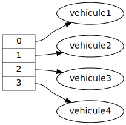

# Module 3.1: structure générique (1)

 

CONSEIL: prendre l'habitude de dessiner de graphe d'objets. P.ex. pour un tableau contenant 4 véhicule:
 
 

1. $[link ./theorie/](Théorie)
1. <a href="https://cmontmorency.moodle.decclic.qc.ca/mod/quiz/view.php?id=213719" target="_blank">Mini-test sur la théorie</a>
1. $[link ./tutoriel/](Tutoriel)
1. $[link ./atelier/](Atelier)
1. <a href="https://cmontmorency.moodle.decclic.qc.ca/mod/quiz/view.php?id=213720" target="_blank">Mini-test sur l'atelier</a>

 

RAPPEL: toutes les évaluations sont <strong>individuelles</strong> 
<ul>
<li>chaque remise est analysée par un outil de détection de plagiat
<li>ne <strong>jamais</strong> copier-coller le code d'un autre étudiant
<li>ne <strong>jamais</strong> écrire directement le code qu'un autre étudiant vous dicte
</ul> 

