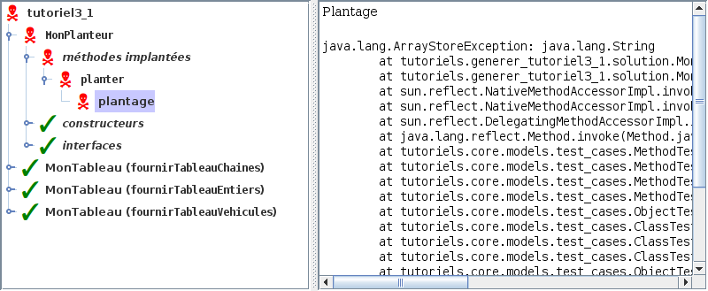

# Tutoriel 3.1: structure générique (1)

## Objectifs

1. En utilisant Eclipse, je crée un nouveau projet Java
    * Le projet doit **obligatoirement** être comme suit:
        * nom du projet: `tutoriel3_1`
        * chemin du projet: `~/3c6_PRENOM_NOM/tutoriel3_1`
        * le projet doit utiliser le **JDK 1.8**
        * le projet utilise la librairie $[download ./tutoriel3_1.jar](tutoriel3_1.jar)
        * le projet utilise la base de données $[download ./tutoriel3_1.db](tutoriel3_1.db)

1. Je crée la classe `MonTutoriel3_1` qui hérite de la classe `Tutoriel3_1`

1. Je crée l'interface `Tableau` pour un tableau générique où: 
    * les éléments sont des `Comparable`
    * les indices sont des entiers
    * les méthodes supportées sont:
        * `obtenirValeur`: 
            * reçoit un `indice`
            * retourne l'élément à cet `indice`
        * `modifierValeur`: 
            * reçoit un `indice` et un `element`
            * mémmorise l'`element` à cet `indice`
        * `valeurMinimale`:
            * retourne le plus petit élément

1. Je crée la classe `MonTableau` qui implante mon interface `Tableau`
    * j'ajoute un constructeur qui reçoit un tableau de valeurs initiales

1. Je crée la classe `MonPlanteur` qui implante l'interface `Planteur`
    * la méthode `planter` doit contenir une erreur d'exécution directement liée à la création et l'utilisation d'un objet `MonTableau`

1. Je corrige les erreurs de compilation

1. J'ajoute une méthode `main` à la classe `MonTutoriel3_1`:

    $[java ./MonTutoriel3_1 3 6]()

1. J'implante les méthodes pour remplir le contrat du `Tutoriel3_1`, p.ex:

    $[java ./MonTutoriel3_1 8 26]()

    * NOTE: il y a des valeurs à passer aux constructeurs

1. J'exécute mon projet et je valide mes classes et mes méthodes
    * je vérifie que `MonPlanteur` fait une erreur d'exécution: ☠ 

    

    
    

1. J'ajoute les fichiers du projet dans Git 

1. Je fais un `commit` et un `push`

## Réalisation

### Étape 01: créer le projet `tutoriel3_1`

1. Je crée un projet nommé `tutoriel3_1`
    * *File* => *New* => *Java Project*
        * Je décoche *Use default location*
            * je navigue à la racine du dépôt Git `~/3c6_PRENOM_NOM`
            * je crée un nouveau répertoire nommé `tutoriel3_1`
            * je sélectionne ce nouveau répertoire
        * Je vérifie que le projet utilise le JDK **1.8**
        * Je clique sur *Finish*

### Étape 02: ajouter la librairie `tutoriel3_1.jar`

1. Je télécharge le fichier $[download ./tutoriel3_1.jar](tutoriel3_1.jar) et je le place **à la racine du projet**

1. Je rafraîchis Eclipse afin de voir le fichier `.jar`
    * *Clique-droit* sur le projet => *Refresh*

1. J'ajoute la librairie au `classpath`:
    * *Clique-droit* sur le projet => *Build path* => *Configure Build Path*
        * Onglet *Librairies* =>
        * Je clique sur *Add JARs...*
            * je sélectionne le projet `tutoriel3_1`
            * je sélectionne le fichier `tutoriel3_1.jar`
        * Je clique sur *Apply and Close*

### Étape 03: ajouter la base de données `tutoriel3_1.db`

1. Je télécharge le fichier $[download ./tutoriel3_1.db](tutoriel3_1.db) et je le place **à la racine du projet**

1. Je rafraîchis Eclipse afin de voir le fichier `.db`
    * *Clique-droit* sur le projet => *Refresh*

### Étape 04: créer la classe `MonTutoriel3_1`

1. Je crée une nouvelle classe nommée `MonTutoriel3_1`
    * *Clique-droit* sur le projet => *New* => *Class*
        *  *Name*: `MonTutoriel3_1`

### Étape 05: hériter de Tutoriel3_1

1. J'ouvre `MonTutoriel3_1` et j'ajoute `extends Tutoriel3_1`

1. J'utilise $[kbd](Ctrl+1) pour ajouter le `import` de `Tutoriel3_1`

1. J'utilise $[kbd](Ctrl+1) pour générer les méthodes manquantes
    * option `add unimplemented methods`

### Étape 06: créer l'interface `Tableau`

1. Je crée une nouvelle classe nommée `Tableau`
    * *Clique-droit* sur le projet => *New* => *Class*
        *  *Name*: `Tableau`

1. J'ouvre `Tableau` et je code l'interface:

    $[java ./Tableau]()

### Étape 07: créer la classe `MonTableau`

1. Je crée une nouvelle classe nommée `MonTableau`
    * *Clique-droit* sur le projet => *New* => *Class*
        *  *Name*: `MonTableau`

1. J'utilise $[kbd](Ctrl+1) pour générer les méthodes manquantes
    * option `add unimplemented methods`

1. J'ouvre `MonTableau` et je code la classe:

    $[java ./MonTableau]()

### Étape 08: créer la classe `MonPlanteur`

1. Je crée une nouvelle classe nommée `MonPlanteur`
    * *Clique-droit* sur le projet => *New* => *Class*
        *  *Name*: `MonPlanteur`

1. J'ouvre `MonPlanteur` et j'ajoute `implements Planteur`

1. J'utilise $[kbd](Ctrl+1) pour ajouter le `import` de `Planteur`

1. J'utilise $[kbd](Ctrl+1) pour générer les méthodes manquantes
    * option `add unimplemented methods`

1. J'ouvre `MonPlanteur` et je code la classe:

    $[java ./MonPlanteur]()

### Étape 09: ajouter la méthode `main`

1. J'ouvre `MonTutoriel3_1` et j'ajoute la méthode `main`

    $[java ./MonTutoriel3_1 1 6]()
 
### Étape 10: remplir le contrat `Tutoriel3_1`

1. J'implante les méthodes pour remplir le contrat du `Tutoriel3_1`, p.ex:

    $[java ./MonTutoriel3_1 8 26]()

    * NOTE: il y a des valeurs à passer aux constructeurs

### Étape 11: exécuter pour valider

1. J'exécute mon programme

1. Je vérifie que la validation est réussie:

    

    
    

    * NOTE: en particulier, `planter` doit lancer une erreur d'exécution
