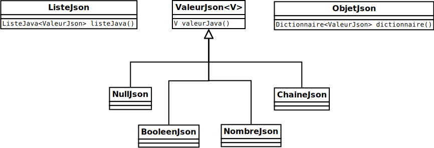

# Théorie 4.1: structures JSON (1)

<video width="50%" src="01.mp4" type="video/mp4" controls>

* Le format JSON est très populaire pour représenter des données

* JSON veut dire *Javascript Object Notation*

* C'est le format prévilégié pour les applications Web

* Les bases de données NoSQL utilisent souvent un format similaire à JSON

## Le format JSON (1)

<video width="50%" src="02.mp4" type="video/mp4" controls>

* Voici les *valeurs* en JSON:
    * la valeur nulle: `null`
    * un booléen: `true`  ou `false`
    * un nombre comme: `1`, `4.5`, `-10.1` 
    * une chaîne comme: `"asdf"`, `""`, `"Bonjour!"`

* Voici les *structures* en JSON:
    * une liste comme: 
        * `[1, 3, -1]`
        * `[]`
        * `["asfd", "Bonjour!", ""]`
    * une objet comme: 
        * `{"cle01":true}`
        * `{}`
        * `{"cle01":true, "cle02":-12}`

* On peut aussi combiner les listes et les objets ($[link ../../02/theorie/](théorie 4.2))

## Les listes en JSON

<video width="50%" src="03.mp4" type="video/mp4" controls>

* En général, une liste est un tableau qui peut grandir et rapetisser
    * notre `Tableau` générique est en fait un exemple de liste:

        $[java ./ListeJava]()

* Une des particularité des la liste JSON est de mélanger les types de valeurs:
    * `[1,true,"Bonjour!"]`
    * `[null, "", 1, false]`

## Les objets JSON

<video width="50%" src="04.mp4" type="video/mp4" controls>

* Un objet JSON permet d'accéder à des valeurs avec des clés
    * une clé est toujours une chaîne
    * la valeur peut être n'importe quelle valeur JSON

* L'objet JSON est un exemple de `Dictionnaire`:

    $[java ./Dictionnaire]()

* Quand on entrepose une valeur, le dictionnaire:
    * grandit si la clé n'existait pas
    * modifie la valeur si la clé existait

    $[java ./Dictionnaire_exemple]()

## Représentation Java de JSON (1)

<video width="50%" src="05.mp4" type="video/mp4" controls>

* On peut représenter des données JSON avec la hiérarchie suivante:
    

    
    

    * NOTE: on va l'améliorer à la $[link ../../02/theorie/](théorie 4.2)

* Une `ValeurJson` est soit:
    * `NullJson`
    * `BooleenJson`
    * `NombreJson`
    * `ChaineJson`

* Une `ValeurJson` contient une `valeurJava()`
    * c'est-à-dire l'équivalent Java de la valeur JSON chargée d'un fichier

* Une `ListeJson` contient une `ListeJava`
    * c'est-à-dire une liste contenant des `ValeurJson`

* Un `ObjetJson` contient un `dictionnaire` où
    * les clés sont des chaînes 
    * les valeurs sont des `ValeurJson`

* À noter que `ValeurJson` est paramétrée. On va avoir ce genre de signature:

    $[java ./MaChaineJson 1 1]()

    * `MaChaineJson` est une `ValeurJson` qui contient une `String`

## Analyse syntaxique (*parser*)

<video width="50%" src="06.mp4" type="video/mp4" controls>

* L'analyse syntaxique consiste à:
    * lire un fichier avec un certain format
    * analyser les données du fichier 
    * créer une structure en mémoire qui contient les mêmes données

* L'exemple typique est l'analyse syntaxique que le compilateur fait de votre code

* Il s'agit d'un sujet assez vaste. Dans ce cours on va faire un survol bref.

## Analyse syntaxique de JSON (1)

<video width="50%" src="07.mp4" type="video/mp4" controls>

* lire des chaînes comme `["asdf", null]` et `{"cle01":12, "cle02":true}`

* créer les structures Java qui correspondent, p.ex:

    $[java ./AnalyseJson]()

* Évidemment, on veut le faire automatiquement et pour n'importe quelle entrée

* Pour ce faire, chaque classe de notre hiérarchie va implanter `Chargeable`:

    $[java ./Chargeable]()

* La méthode `chargerEtRetournerResteDuTexte` fonctionne comme suit:
    * recevoir en entrée du `texteJson` partiel comme `"asdf",12]`
    * lire une valeur comme la chaîne `"asdf"`
    * retirer la valeur du texte `,12]`
    * retourner ce qu'il reste du texte
    * s'il est impossible de lire une valeur, lancer l'exception `ErreurDeChargement`

* Par exemple, voici comment charger une valeur:

    $[java ./MonChargeurJson]()

    * on crée un objet pour toutes les valeurs possibles
    * pour chaque valeur possible, on essaie de charger la valeur
        * si c'est possible, on arrête de chercher avec `break`
        * si ce n'est pas possible, on capte l'exception et on continue

* En mots, l'exemple ci-haut fonctionne comme suit:
    * est-ce possible de charger un `null`? Si oui, on arrête.
    * est-ce possible de charger un booléen? Si oui, on arrête.
    * est-ce possible de charger une chaîne? Si oui, on arrête.
    * est-ce possible de charger un nombre? Si oui, on arrête.
    * sinon, on va lancer `ErreurDeChargement`

* Ce code ci-haut se trouve dans un `ChargeurJson`:

    $[java ./ChargeurJson]()

    * le chargeur est capable de charger soit une valeur, une liste ou un objet
    * `resteDuTexteJson()` permet d'aller chercher ce qui reste après un chargement

## Exemple de `MaChaineJson`

<video width="50%" src="08.mp4" type="video/mp4" controls>

* Pour charger une chaîne, il faut chercher un patron `"..."` où `...` est une chaîne

* On peut utiliser une expression régulière:

    $[java ./MaChaineJson]()

* Le patron est `^"([^"]*)"`:
    * `^` pour chercher au début du `texteJson`
    * `()` permet d'extraire un *groupe* (un sous-patron)
    * `[^"]*` permet de chercher pour n'importe quel caractères sauf `"`

* En mots, le patron est donc:
    * on cherche `"`, suivi d'un ou plusieurs caractères, suivi d'un autre `"`

* La méthode `chargerEtRetournerResteDuTexte` va donc:
    * lignes 9 et 11) chercher le patron dans `texteJson`
    * ligne 13) si le patron est trouvé, extraire la valeur entre les `"`
    * ligne 15) retirer le patron
    * retourner ce qu'il reste du `texteJson`
    * si la patron n'est pas trouvé, lancer l'exception `ErreurDeChargement`
