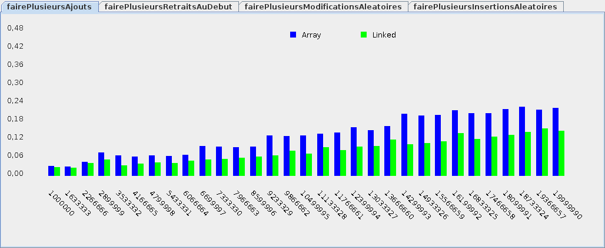
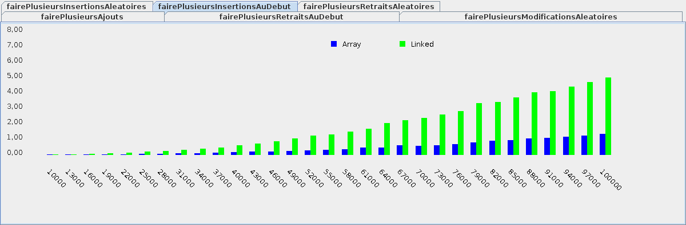
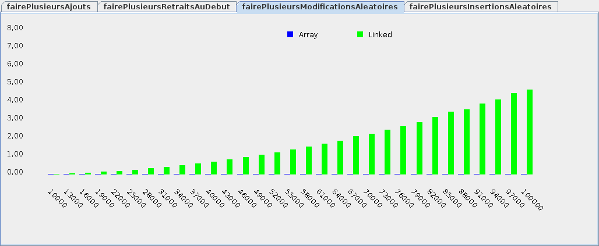
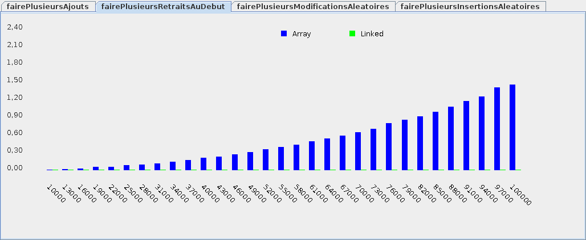
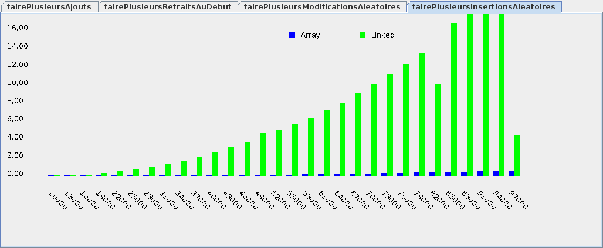
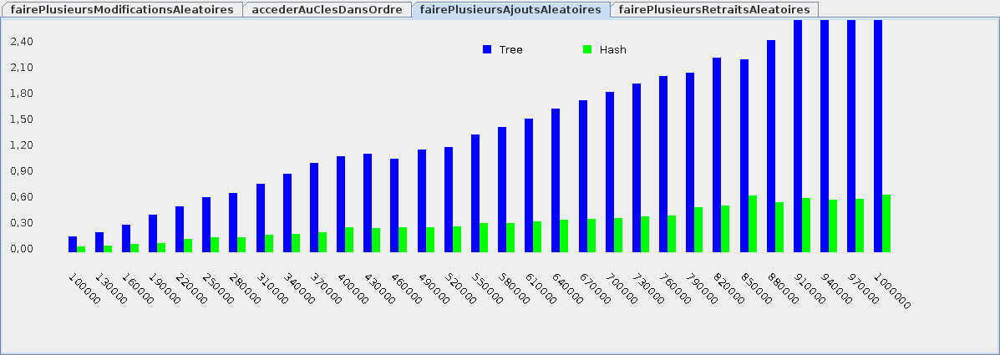
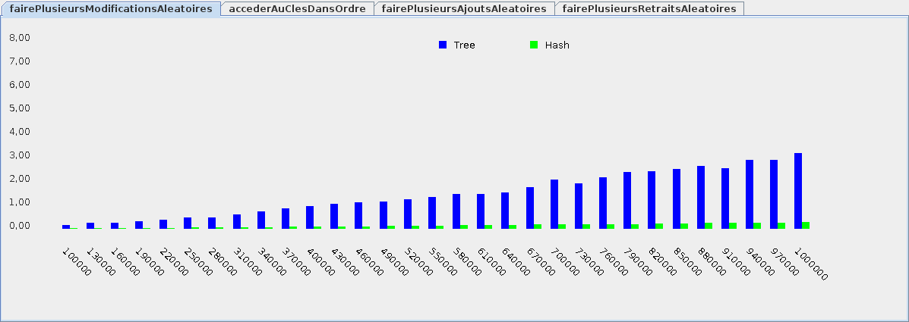
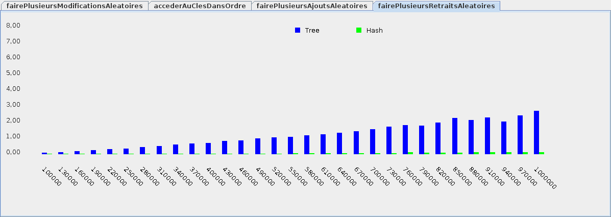
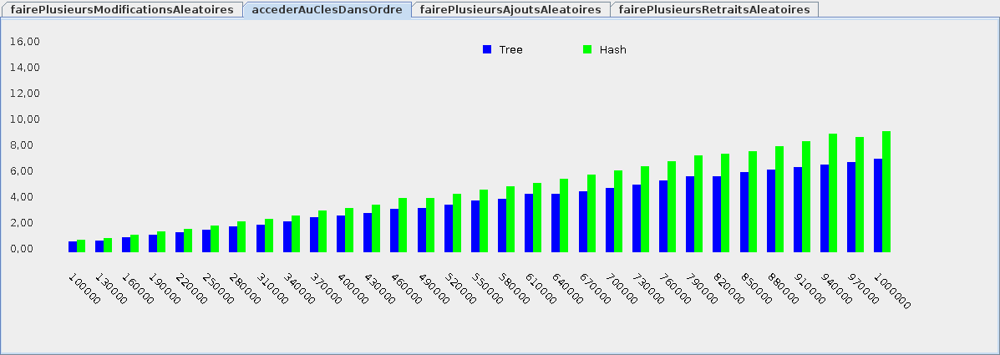

# Théorie 4.3: structures Java

<video width="50%" src="01.mp4" type="video/mp4" controls>

* Le JDK Java contient plusieurs structures de données déjà codées

* Dans ce cours, on va se concentrer sur les deux principales:
    * `List<E>`: une liste générique
    * `Map<K,V>`: un dictionnaire générique (mappage)

* À partir de maintenant, vous devriez:
    * toujours utiliser une `List<Integer>` et jamais un tableau `int[]`
    * toujours utiliser les structures fournies dans le SDK Java
        * (et jamais une structure maison comme `MaListeJava`)

* Exception: pour des raisons pédagogiques
    * p.ex. pour comprendre comment coder une liste

## `List<E>`: liste générique

<video width="50%" src="02.mp4" type="video/mp4" controls>

* Exemple d'utilisation:

    $[java ./List_exemples]()

* Extrait de l'interface:

    $[java ./List_interface]()

* Documentation complète: 
    * <a target="_blank" href="https://docs.oracle.com/javase/8/docs/api/java/util/List.html">https://docs.oracle.com/javase/8/docs/api/java/util/List.html</a>

## Implantations de `List<E>`

<video width="50%" src="03.mp4" type="video/mp4" controls>

* `List<E>` est une interface

* Le SDK Java fournit différentes implantations, p.ex:
    * `ArrayList<E>`
    * `LinkedList<E>`

* Quelle est la différence?
    * à utiliser: aucune (c'est la même interface)
    * à coder: on en parle à partir de l'$[link ../../../05/01/](étape 5.1)
    * en terme d'efficacité? on va le tester!

### Comparaison des implantations

* Chaque implantation a ses avantages et ses inconvénients

* Pour ajouter des éléments **à la fin**:
    * `LinkedList` un peu plus efficace

    

        
    

* Pour insérer des éléments **au début**: 
    * `ArrayList` plus effiace

    

        
    

* Pour insérer des éléments un peu partout:
    * `ArrayList` beaucoup plus efficace

    

        
    

* Pour retirer des éléments **au début**: 
    * `LinkedList` beaucoup plus efficace

    

        
    

* Pour modifier des éléments un peu partout:
    * `ArrayList` beaucoup plus efficace

    

        
    

## `List<E>`: quand utiliser quelle implantation?

* Par défaut, on recommande `ArrayList`

* `LinkedList` est plus spécialisée

* Par exemple, on devrait utiliser `LinkedList` pour une file d'attente:
    * on ajoute toujours à la fin
    * on retire toujours au début

* NOTE: le Java SDK fournit aussi la structure `Deque<E>` spécifiquement pour les files:
    * <a href="https://docs.oracle.com/javase/7/docs/api/java/util/Deque.html" target="_blank">https://docs.oracle.com/javase/7/docs/api/java/util/Deque.html</a>

* Une `Deque<E>` est aussi efficace pour une *pile*:
    * on insère toujours au début
    * on retire toujours au début

## `Map<K,V>`: mappage générique

<video width="50%" src="04.mp4" type="video/mp4" controls>

* Les clés d'un mappage peuvent être de n'importe quel type
    * contrairement à notre `Dictionnaire` où les clés étaients toujours des chaînes

* Il y a deux paramètres de types:
    * `K`: le type des clés
    * `V`: le type des valeurs

* IMPORTANT: une clé est associée à **une seule valeur**

* Exemple d'utilisation:

    $[java ./Map_exemples]()

    * NOTE: on utilise la notation `<P1, P2>` quand il y a plusieurs paramètres de type

* Extrait de l'interface:

    $[java ./Map_interface]()

* Documentation complète: 
    * <a href="https://docs.oracle.com/javase/8/docs/api/java/util/Map.html" target="_blank">https://docs.oracle.com/javase/8/docs/api/java/util/Map.html</a>

## Implantations de `Map<K,V>`

<video width="50%" src="05.mp4" type="video/mp4" controls>

* Le SDK Java fournit différentes implantations, p.ex:
    * `HashMap<K,V>`
    * `TreeMap<K,V>`
    * `LinkedHashMap<K,V>`

* Quelle est la différence?
    * à utiliser: presqu'aucune (*)
    * à coder: on en parle à partir de l'$[link ../../../05/03/](étape 5.3)
    * en terme d'efficacité? on va le tester!

* (*) `LinkedHashMap` est un cas spécial:
    * en plus d'implanter l'interface `Map<K,V>`, on ajoute la promesse suivante:
        * il est possible d'accéder aux clés dans l'ordre où elles ont été insérées

### Comparaison des implantations

* L'implantation `HashMap` est typiquement supérieure

* Pour ajouter plusieurs valeurs
    * `HashMap` est beaucoup plus efficace

    

        
    

* Pour modifier plusieurs valeurs:
    * `HashMap` est plus efficace

    

        
    

* Pour retirer plusieurs valeurs:
    * `HashMap` est plus efficace

    

        
    

* Pour accéder aux clés de la plus petite à la plus grande:
    * `TreeMap` est très légèrement plus efficace

    

        
    

## `Map<K,V>`: quand utiliser quelle implantation?

* Utiliser `HashMap` par défaut

* Mais `TreeMap` peut être utile dans certains cas:
    * p.ex. ça consomme moins d'espace mémoire (voir $[link ../../04/theorie](théorie 4.4))
