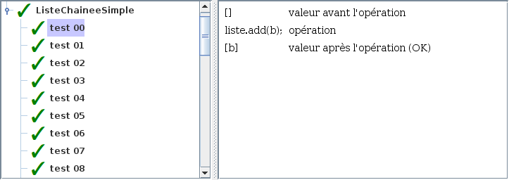
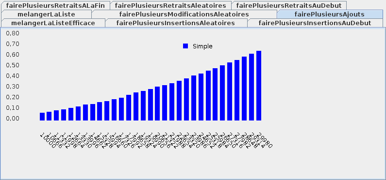

# Tutoriel 5.2: liste chaînée simple

## Objectifs

1. En utilisant Eclipse, je crée un nouveau projet Java
    * Le projet doit **obligatoirement** être comme suit:
        * nom du projet: `tutoriel5_2`
        * chemin du projet: `~/3c6_PRENOM_NOM/tutoriel5_2`
        * le projet doit utiliser le **JDK 1.8**
        * le projet utilise la librairie $[download ./tutoriel5_2.jar](tutoriel5_2.jar)

1. À partir de l'$[link ../../01/atelier/](atelier 5.1), je recopie la classe:
    * `TesteurDeListeAbstrait`

1. Je crée la classe `ElementChaineSimple` 

1. Je crée la classe `ListeJavaChaineeSimple` qui hérite de la classe `ListeJava`

1. En suivant la théorie, j'implante les méthodes pour remplir le contrat de `ListeJava`
    * il faut mémoriser la taille de la liste
    * il faut mémoriser la tête de la liste
      
    

    ATTENTION: la tête est souvent un cas spécial, p.ex:
    <ul>
    <li>sur `add('a')`, il faut créer la tête si elle n'existe pas
    <li>sur `remove(0)`, il faut mémoriser une nouvelle tête
    </ul>
    

     
     

1. Je crée la classe `TesteurDeListeChaineeSimple`

1. Je crée la classe `MonTutoriel5_2` qui hérite de la classe `Tutoriel5_2`

1. Je corrige les erreurs de compilation

1. J'ajoute une méthode `main` à la classe `MonTutoriel5_2`:

    $[java ./MonTutoriel5_2 3 6]()

1. J'implante les méthodes pour remplir le contrat du `Tutoriel5_2`, p.ex:

    $[java ./MonTutoriel5_2 8 31]()

1. J'exécute mon projet, je valide mon code et vérifie la performance:

    

        
    

    

        
    

1. J'ajoute les fichiers du projet dans Git 

1. Je fais un `commit` et un `push`

## Réalisation

### Étape 01: créer le projet `tutoriel5_2`

1. Je crée un projet nommé `tutoriel5_2`
    * *File* => *New* => *Java Project*
        * Je décoche *Use default location*
            * je navigue à la racine du dépôt Git `~/3c6_PRENOM_NOM`
            * je crée un nouveau répertoire nommé `tutoriel5_2`
            * je sélectionne ce nouveau répertoire
        * Je vérifie que le projet utilise le JDK **1.8**
        * Je clique sur *Finish*

### Étape 02: ajouter la librairie `tutoriel5_2.jar`

1. Je télécharge le fichier $[download ./tutoriel5_2.jar](tutoriel5_2.jar) et je le place **à la racine du projet**

1. Je rafraîchis Eclipse afin de voir le fichier `.jar`
    * *Clique-droit* sur le projet => *Refresh*

1. J'ajoute la librairie au `classpath`:
    * *Clique-droit* sur le projet => *Build path* => *Configure Build Path*
        * Onglet *Librairies* =>
        * Je clique sur *Add JARs...*
            * je sélectionne le projet `tutoriel5_2`
            * je sélectionne le fichier `tutoriel5_2.jar`
        * Je clique sur *Apply and Close*

### Étape 03: créer la classe `MonTutoriel5_2`

1. Je crée une nouvelle classe nommée `MonTutoriel5_2`
    * *Clique-droit* sur le projet => *New* => *Class*
        *  *Name*: `MonTutoriel5_2`

### Étape 04: hériter de Tutoriel5_2

1. J'ouvre `MonTutoriel5_2` et j'ajoute `extends Tutoriel5_2`

1. J'utilise $[kbd](Ctrl+1) pour ajouter le `import` de `Tutoriel5_2`

1. J'utilise $[kbd](Ctrl+1) pour générer les méthodes manquantes
    * option `add unimplemented methods`

### Étape 05: créer la classe `ElementChaineSimple`

1. Je crée une nouvelle classe nommée `ElementChaineSimple`
    * *Clique-droit* sur le projet => *New* => *Class*
        *  *Name*: `ElementChaineSimple`

1. J'ouvre `ElementChaineSimple` et je complète la signature:

    $[java ./ElementChaineSimple 1 1]()

<!--
1. J'utilise $[kbd](Ctrl+1) pour générer les méthodes manquantes
    * option `add unimplemented methods`
    -->

1. Je code la classe:

    $[java ./ElementChaineSimple]()

### Étape 06: créer la classe `ListeJavaChaineeSimple`

1. Je crée une nouvelle classe nommée `ListeJavaChaineeSimple`
    * *Clique-droit* sur le projet => *New* => *Class*
        *  *Name*: `ListeJavaChaineeSimple`

1. J'ouvre `ListeJavaChaineeSimple` et je complète la signature:

    $[java ./ListeJavaChaineeSimple 1 1]()

1. J'utilise $[kbd](Ctrl+1) pour générer les méthodes manquantes
    * option `add unimplemented methods`

1. Je code la classe:

    $[java ./ListeJavaChaineeSimple]()

### Étape 07: créer la classe `TesteurDeListeChaineeSimple`

1. Je crée une nouvelle classe nommée `TesteurDeListeChaineeSimple`
    * *Clique-droit* sur le projet => *New* => *Class*
        *  *Name*: `TesteurDeListeChaineeSimple`

1. J'ouvre `TesteurDeListeChaineeSimple` et je complète la signature:

    $[java ./TesteurDeListeChaineeSimple 1 1]()

1. J'utilise $[kbd](Ctrl+1) pour générer les méthodes manquantes
    * option `add unimplemented methods`

1. Je code la classe:

    $[java ./TesteurDeListeChaineeSimple]()

### Étape 08: remplir le contrat `Tutoriel5_2`

1. J'implante les méthodes pour remplir le contrat du `Tutoriel5_2`, p.ex:

    $[java ./MonTutoriel5_2 8 31]()

### Étape 09: ajouter la méthode `main`

1. J'ouvre `MonTutoriel5_2` et j'ajoute la méthode `main`

    $[java ./MonTutoriel5_2 1 6]()

### Étape 10: exécuter pour valider

1. J'exécute mon projet, je valide mon code et vérifie la performance:

    

        
    

    

        
    

