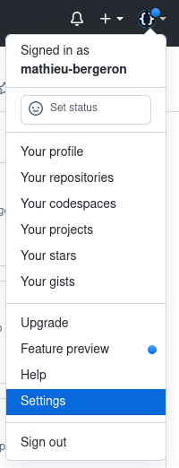
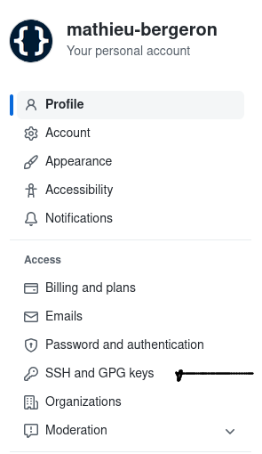
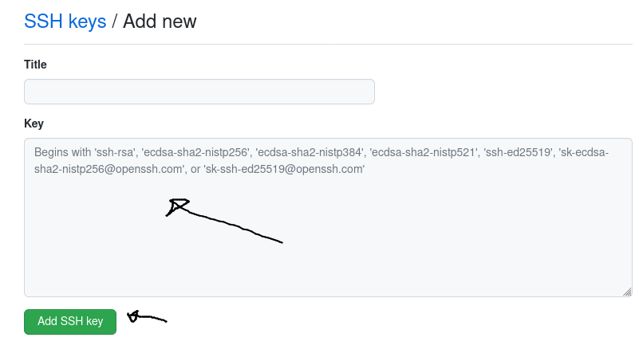

# Tutoriel 2.2: configurer SSH

<strong>IMPORTANT</strong>

<ul>
<li>Je fais ces étapes <strong>une fois par machine</strong> où je travaille, p.ex:
<ul>
 
<li>une fois sur le Windows du Collège
<li>une autre fois sur mon portable
</ul>
</ul>

## Créer ma clé SSH

* J'ouvre Git-Bash

* Je crée ma clé SSH

        $ ssh-keygen.exe

            # faire Entrée pour accpter les options par défaut

## Copier ma clé publique

* J'ouvre ma clé publique avec Notepad

        $ notepad.exe ~/.ssh/id_rsa.pub

* Je copie tout le texte p.ex. avec $[kbd](Ctrl+A) et $[kbd](Ctrl+C)

## Ajouter ma clé SSH à mon dépôt Git

* Je me connecte à GitHub

* J'ouvre les paramètres de mon profile GitHub

    

* Je clique sur *SSH and GPG keys*

    

* Je clique sur *New SSH key*

    

* Je copie le texte de la clé que j'avais copier:

* Je clique sur *Add SSH key*

    

