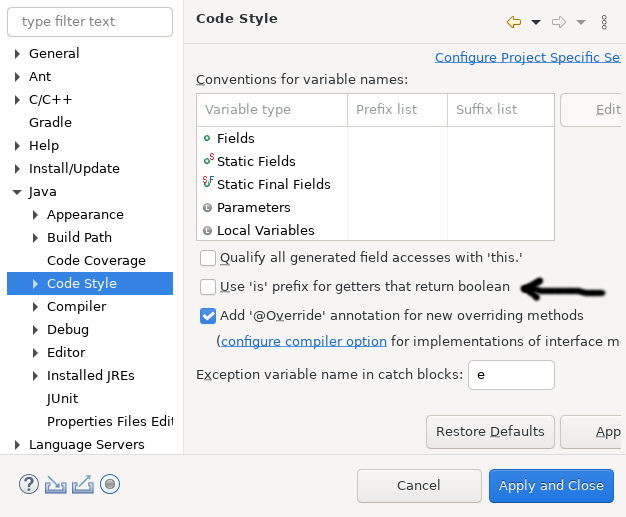

# Théorie: sauvegarde d'un modèle en JSON

<video width="50%" src="fichiers.mp4" type="video/mp4" controls>

1. Par défaut, `Ntro` entrepose les modèles dans des fichiers `.json`

1. Les fichiers sont ici

    `_storage/models/`

1. Par exemple, le modèle `ModeleTexte` est sauvegardé dans

    `_storage/models/ModeleTexte.json`

1. Utiliser des fichiers facilite le développement
    * on peut facilement inspecter les modèles
    * on peut modifier les modèles directement dans les fichiers

1. (en production, on peut sauvegarder dans base de données comme MongoDB)

## Ajouter un constructeur par défaut

<video width="50%" src="constructeur.mp4" type="video/mp4" controls>

1. Il faut **obligatoirement** ajouter un constructeur par défaut

    $[java ./ModeleTexte01]()

1. Sans constructeur par défaut, `Ntro` ne pourra pas créer le modèle en Java

## Ajouter des accesseurs (méthodes *get/set*)

<video width="50%" src="accesseurs.mp4" type="video/mp4" controls>

1. Il faut **obligatoirement** ajouter des accesseurs

    $[java ./ModeleTexte02]()

1. `Ntro` accède à la valeur des attributs **uniquement** à travers les accesseurs

1. Un attribut sans accesseurs est invisible pour `Ntro`

## Accesseur avec préfixe *get* et *set*

<video width="50%" src="eclipse.mp4" type="video/mp4" controls>

1. `Ntro` supporte **uniquement** les préfixes *get* et *set*

1. **ATTENTION** par défaut Eclipse utilise le préfixe *is* pour les booléens

1. On doit changer cette option
    * *Window* => *Preferences* => *Java* => *Code Style*
        * Décocher *Use 'is' prefix for getters that return boolean*

    

    

