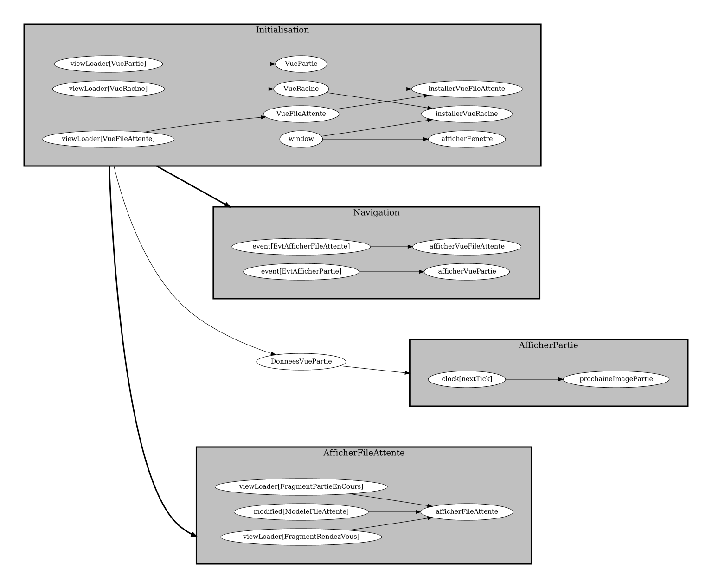
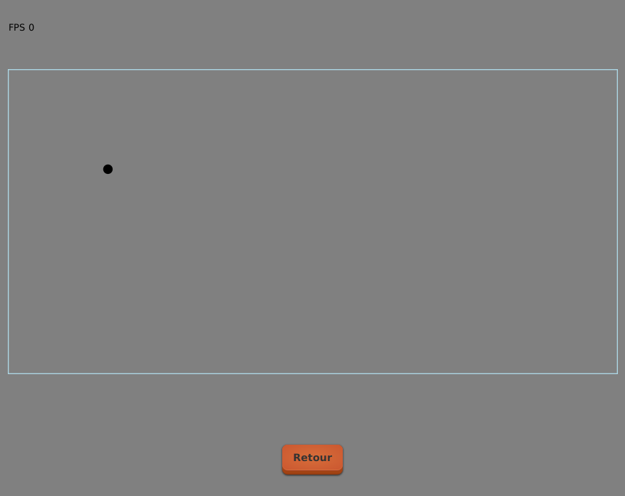
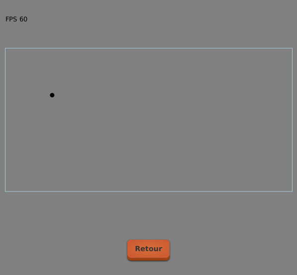

# Tutoriel 9.6: afficher le monde 2d

## Créer une tâche pour l'affichage temps-réel

1. J'ouvre `AfficherPartie` et j'ajoute ce code

    $[java ./AfficherPartie01]()

    * NOTES
        * la tâche `prochaineImagePartie` sera appelée à chaque `clock().nextTick()`
        * ce qui veut dire: le plus souvent possible
        * (en JavaFx, typiquement 60 fois par secondes)

1. Je m'assure que le client s'exécute

        $ cd tutoriels
        $ sh gradlew client

1. Je vérifie le graphe de tâches du frontal

    

        
    

## Coder l'affichage du monde 2d

1. Dans la tâche `prochaineImagePartie`, j'ajoute l'appel suivant

    $[java ./AfficherPartie02]()

1. J'utilise $[kbd](Ctrl+1) pour créer la méthode `DonneesVuePartie.afficherSur`

1. Dans `DonneesVuePartie`, j'ajoute ce code pour la méthode `afficherSur`

    $[java ./DonneesVuePartie01]()

1. J'utilise $[kbd](Ctrl+1) pour créer les méthodes suivantes:
    * `VuePartie.viderCanvas`
    * `VuePartie.afficherImagesParSecondes`
    * `VuePartie.afficherPong2d`

1. Dans `VuePartie`, j'ajoute le code suivant

    $[java ./VuePartie01]()

1. Je m'assure que le client s'exécute et affiche le monde 2d

        $ cd tutoriels
        $ sh gradlew client

    

        
    

    * NOTES
        * c'est normal que le compteur de FPS soit encore à 0

## Coder un compteur de FPS (images par seconde)

1. J'ouvre `DonneesVuePartie` et j'ajoute le code suivant

    $[java ./DonneesVuePartie02]()

1. Je m'assure que le client s'exécute et affiche maintenant le compteur FPS

        $ cd tutoriels
        $ sh gradlew client

    

        
    

